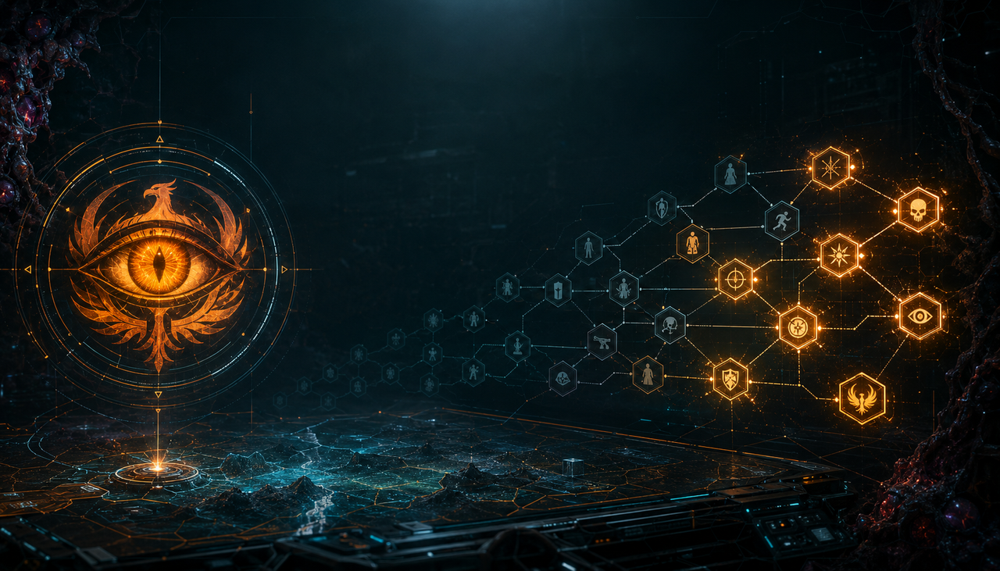

<div align="center">



# Oracle

[](README.md)
[](README.ru.md)

[](https://github.com/UberMorgott/PhoenixPoint-Mod-PerkOracle/stargazers)
[](https://github.com/UberMorgott/PhoenixPoint-Mod-PerkOracle/network/members)
[](https://github.com/UberMorgott/PhoenixPoint-Mod-PerkOracle/issues)
[](https://github.com/UberMorgott/PhoenixPoint-Mod-PerkOracle/commits)
[](https://github.com/UberMorgott/PhoenixPoint-Mod-PerkOracle/releases/latest)
[](LICENSE)

[](https://steamcommunity.com/sharedfiles/filedetails/?id=3739613434)
[](https://github.com/UberMorgott/PhoenixPoint-Mod-PerkOracle/issues/new?labels=bug)
[](https://github.com/UberMorgott/PhoenixPoint-Mod-PerkOracle/issues/new?labels=enhancement)

</div>

Внутриигровой помощник для Phoenix Point: показывает информацию, которую игра обычно скрывает, в виде подсказок при наведении — прямо там, где вы принимаете решения. Игровой контент не меняет (лишь показывает заранее), кроме одной опциональной, по умолчанию выключенной замены перков. Работает отдельно на базовой игре, полностью совместим с TFTV.

## Возможности

- **Подсветка роленых перков** — случайные («роленые») персональные перки получают цветную подсветку на экране прогрессии, чтобы отличать их от фиксированных и классовых.
- **Вики кандидатов** — правый клик по перку открывает окно со всеми перками, которые могли выпасть в этот слот, с родными ячейками способностей и подсказками игры.
- **Вики классов** — клик по выученному классовому навыку на экране прогрессии открывает вики всех классов: ветку способностей и слоты персональных перков каждого класса, взятые вживую из вашей игры (совпадает с TFTV и модами, добавляющими классы, например Officer). Фиксированные слоты TFTV показаны; случайные слоты отображаются как `?` и по клику раскрывают точный пул перков для слота.
- **Предпросмотр подкласса** — при выборе второго класса бойца подтверждение показывает перки этого подкласса и даёт предпросмотр непредложенных подклассов (включая неисследованные, показанные затенёнными).
- **Предпросмотр исхода события** — наведите курсор на вариант ответа в событии на геоскейпе, чтобы увидеть его исход (ресурсы, репутация, здоровье/выносливость бойцов, предметы, открытые точки) до выбора; точно под TFTV. Показывается только когда событие реально предлагает выбор (2+ варианта).
- **Выход при разборе** — подсказки предметов (экипировка, геоскейп, тактика, мутации) показывают строку «DISMANTLE» в нативном стиле с ресурсами за разбор.
- **Опциональная замена перков** — по умолчанию выключена; левый клик по перку в вики заменяет выученный перк бойца в этом слоте на другой существующий (тратит очки навыков, опционально с гейтом по исследованию).

## Настройки (меню модов в игре)

В порядке меню. Логические поля — переключатели, цвет — выбор из пресетов, стоимость — текстовое поле.

| Настройка | По умолч. | Действие |
|---|---|---|
| `EnableRolledPerkHighlight` | `true` | Подсветка случайно выпавших персональных перков на экране прогрессии |
| `RolledPerkHighlightColor` | `Blue` | Цвет подсветки; пресеты Blue, Green, Gold, Red, Purple, White |
| `EnablePerkWiki` | `true` | Разрешить открытие окна-вики кандидатов |
| `EnableSubclassConfirmDecoration` | `true` | Подтверждение выбора подкласса с показом его перков + предпросмотр непредложенных подклассов |
| `ShowEventOutcomePreview` | `true` | Наведение на вариант ответа показывает его исход |
| `ShowDismantleCompensation` | `true` | Показать в подсказке предмета ресурсы за его разбор |
| `AllowPerkSwap` | `false` | Главный переключатель; вкл = левый клик по перку в вики заменяет выученный перк бойца в слоте |
| `RequirePerkSwapResearch` | `true` | Гейт замены по исследованию «Operative Reconditioning» (существует только при включённой замене) |
| `PerkSwapCostsResources` | `true` | Замена тратит очки навыков; блокируется при нехватке |
| `PerkSwapSkillPointCost` | `50` | Стоимость одной замены в очках навыков (0 = бесплатно) |
| `EnableDebugLogging` | `false` | Писать диагностические строки Oracle в лог игры |

## Установка

**Steam Workshop:** [подписаться](https://steamcommunity.com/sharedfiles/filedetails/?id=3739613434) (id 3739613434).

**Вручную:** скачайте `Oracle-*.zip` со [страницы последнего релиза](https://github.com/UberMorgott/PhoenixPoint-Mod-PerkOracle/releases/latest), распакуйте и скопируйте папку `Oracle` (`Oracle.dll`, `meta.json`, `Assets/`) в `Phoenix Point\Mods\`. Включите **Oracle** во внутриигровом менеджере модов; если играете с TFTV, пусть Oracle загружается после него.

**Требования:** базовая игра Phoenix Point. Без зависимостей. TFTV опционален и полностью совместим (тогда Oracle читает данные TFTV по слотам и его расчёт наград); также совместим с модами, добавляющими классы (например, Officer).

## Сборка из исходников

```powershell
dotnet build -c Release
dotnet test
```

## Локализация

English, 简体中文, Français, Deutsch, Italiano, Polski, Русский, Español.

## Лицензия

Oracle © 2026 Morgott. [CC BY-NC 4.0](https://creativecommons.org/licenses/by-nc/4.0/) — свободно использовать и изменять в некоммерческих целях с указанием авторства.

## Благодарности

Сделано **Morgott**. Совместимо с **TFTV** (Voland163). Phoenix Point © Snapshot Games.
